# Shaun the Sheep in "Up, Up & Baa-way!" (a claymation short made entirely in code)


A 2-minute, 22-shot claymation-style short that runs **live in the browser**. There's no video or audio file: the
picture renders in WebGL (three.js) and the soundtrack is synthesised in JavaScript when the page opens.

**The story:** the Farmer drives off and Bitzer settles into his deckchair. A bunch of party balloons drifts over the hedge,
Timmy grabs the string and floats away. The flock builds a sheep tower (a hair too short), Shaun has an idea, and
Shirley launches him off a see-saw to catch Timmy in mid-air. Then Bitzer ends up holding the balloons.

## Screenshots

| | | |
|---|---|---|
| 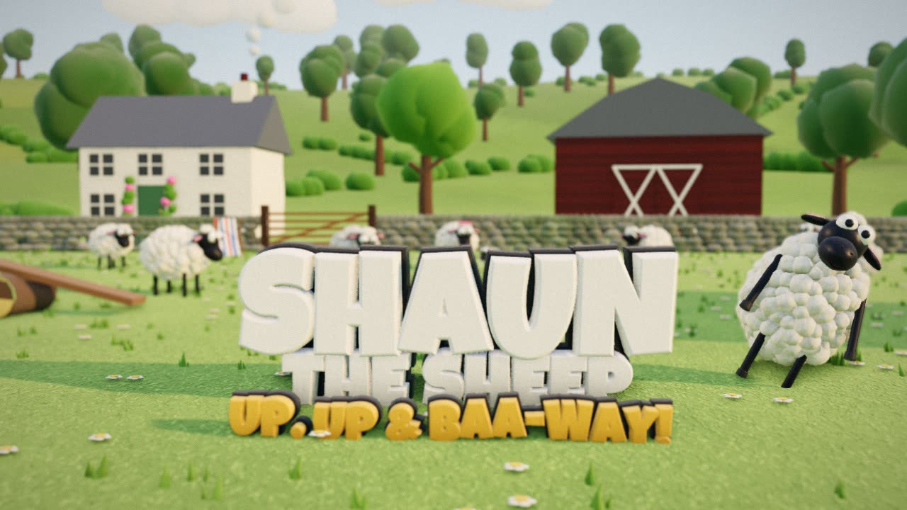 | 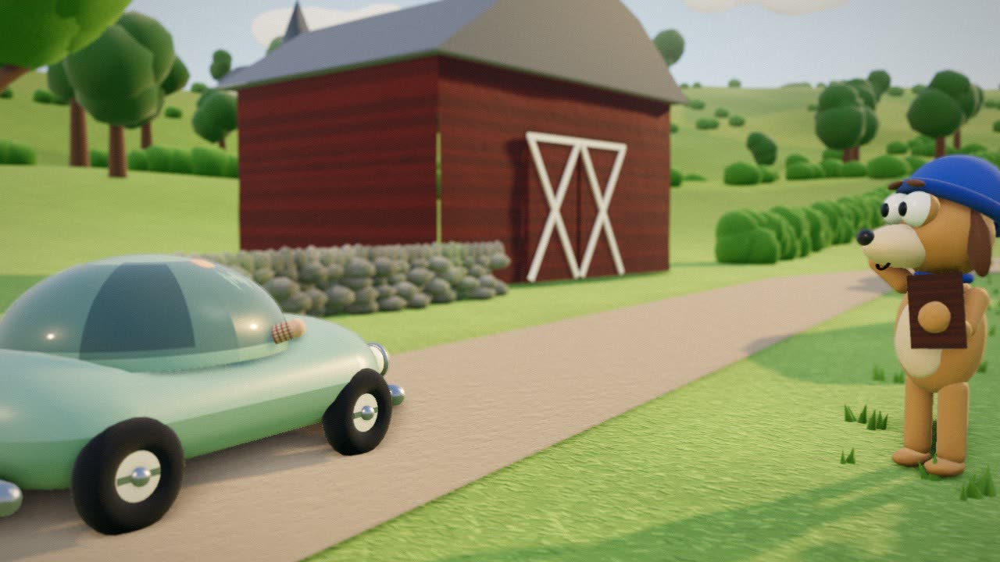 | 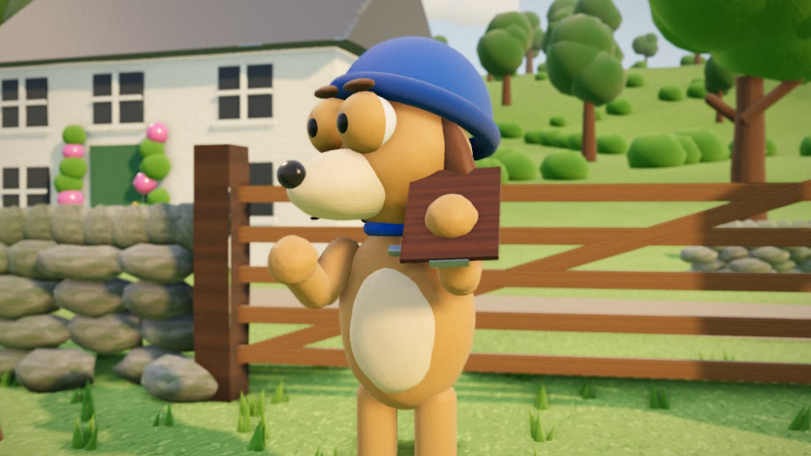 |
| 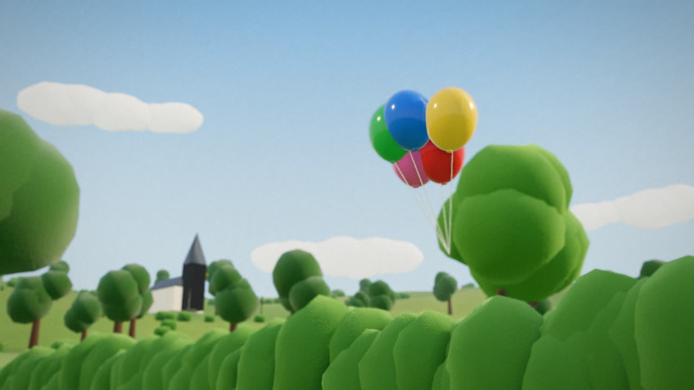 | 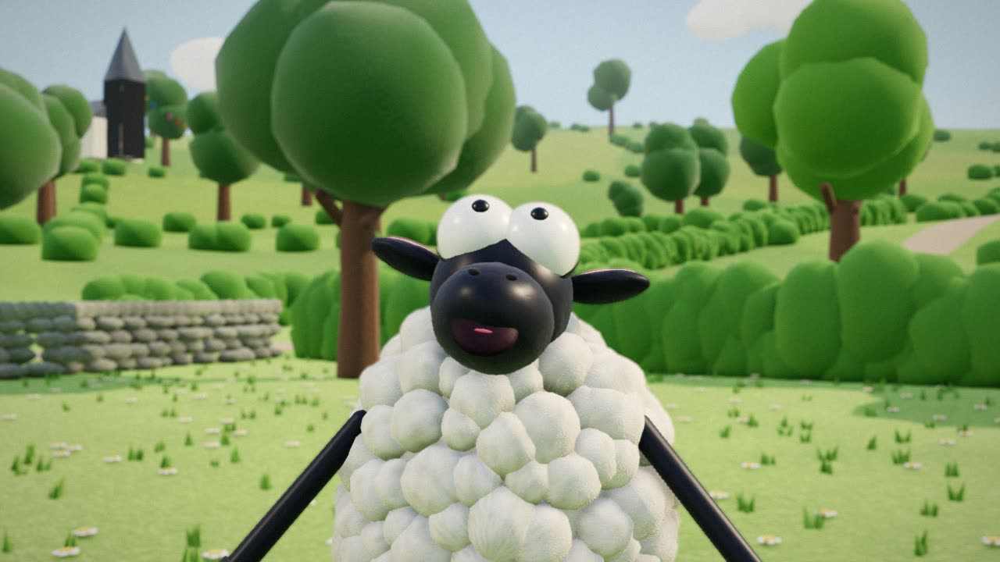 | 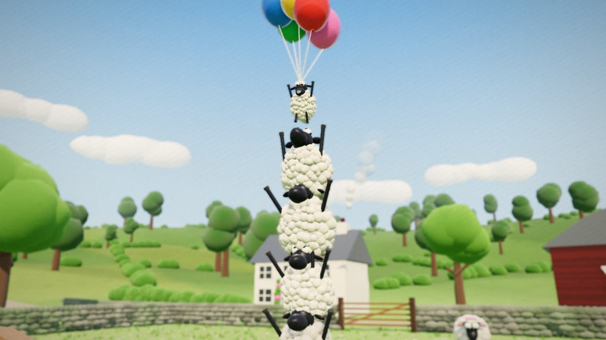 |
| 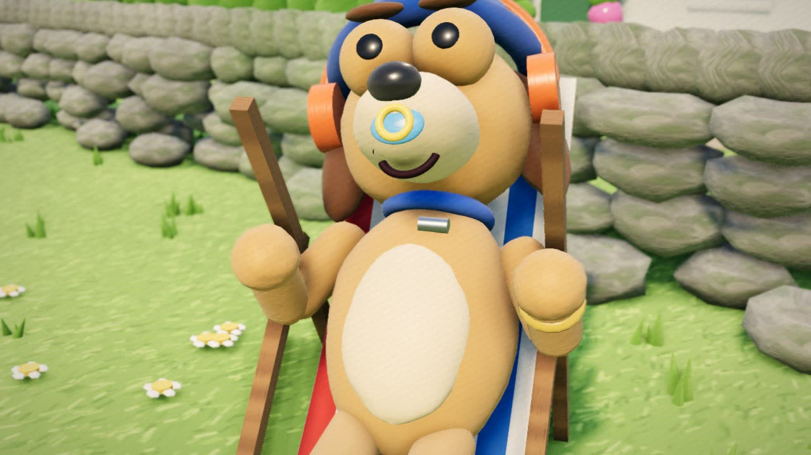 | 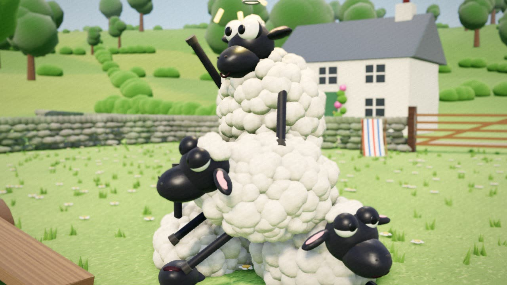 | 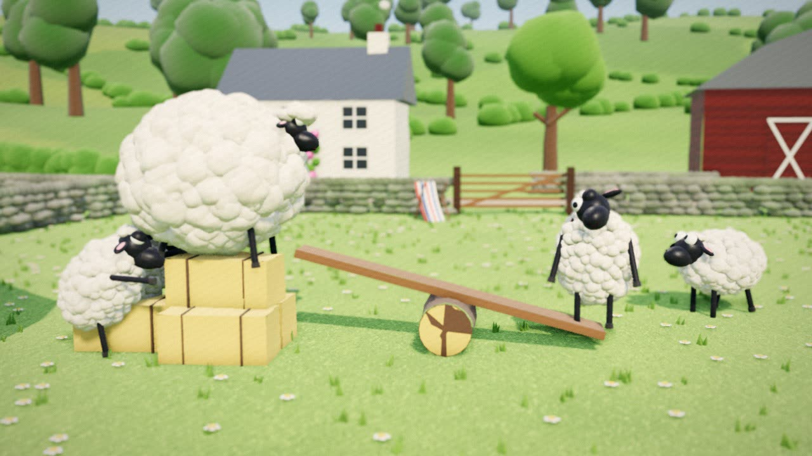 |
| 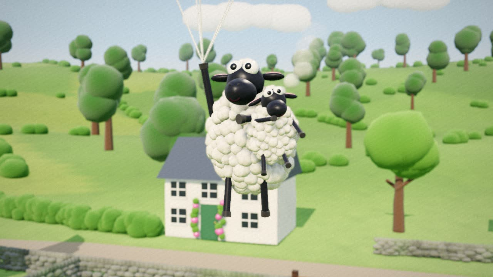 | 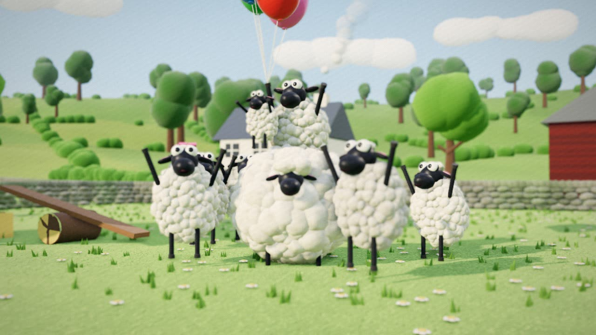 | 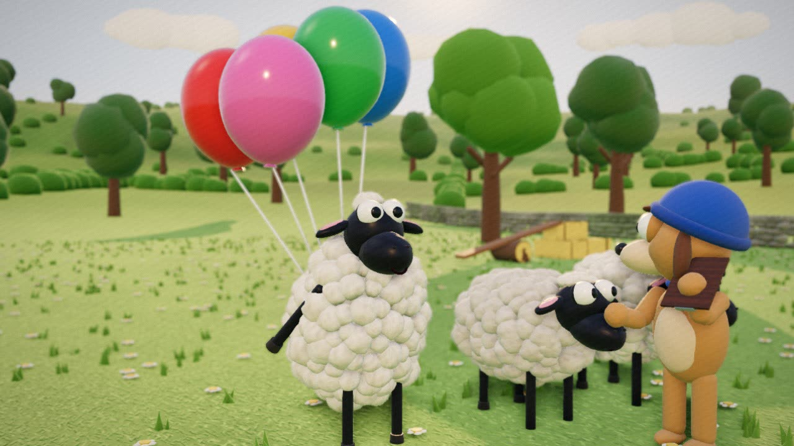 |
| 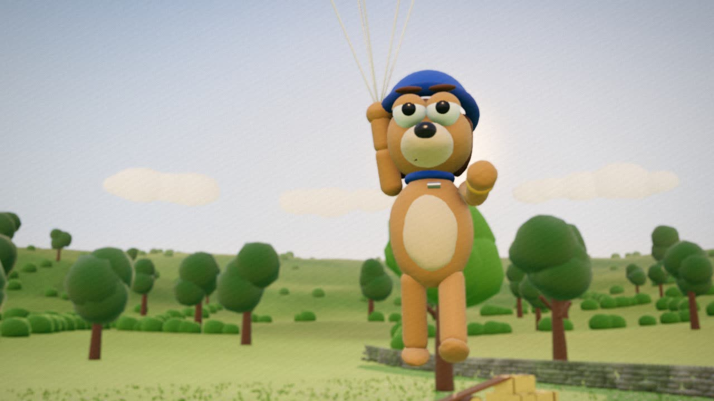 | 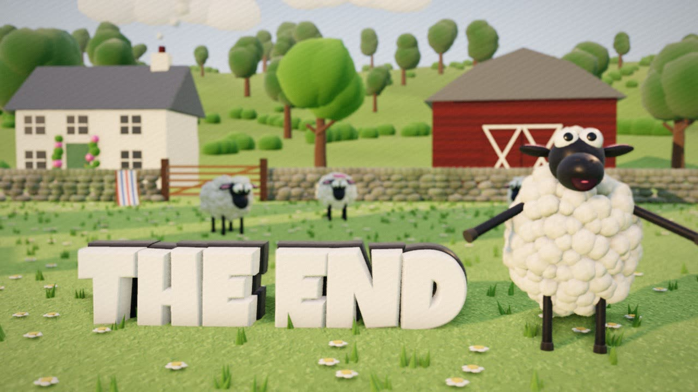 | |

## Run it

```bash
git clone https://github.com/markldn/shaun-claymation && cd shaun-claymation
npm install                      # only the dev tools need it (puppeteer-core); the page itself has no build step
node tools/serve.mjs --port 8998 # then open http://localhost:8998/
```

Press **play**, drag the scrubber, or jump to a shot. The soundtrack is ready a few seconds after the page loads (the status
shows next to the scrubber). Any static http server works; `file://` doesn't, because browsers block ES modules from disk.
A GPU-backed browser (Chrome/Edge/Firefox) is recommended.

## How it's made

- **Clay look**: every puppet is built from lumpy primitives. Procedural canvas textures add thumbprints, tool smears,
  wool curls and flocked grass. Wool is hundreds of merged blobs.
- **Stop-motion**: characters are posed on twos (12 poses a second) while the camera moves on every frame. Each pose also
  gets a tiny surface "boil" and exposure flicker, like a real stop-motion shoot.
- **Post**: ambient occlusion (GTAO), a shallow depth of field so the farm reads as a miniature set, and a film grade
  (warm highlights, vignette, grain, gate weave). The ending closes with an iris wipe.
- **Pure function of time**: `apply(t)` poses everything from the shot table, so any frame can be drawn in any order.
- **Sound** (`src/synth.mjs`, in a Web Worker):
  - Score: a folk-comedy band (Karplus-Strong pizzicato, harp and banjo, penny whistle, clarinet, tuba, accordion, strings, timpani).
  - Voices: formant-synthesised bleats and giggles.
  - Foley: boings, slide whistles, a pea whistle, a sad trombone, the car and its horn.
  - Mix: reverb, compression, limiting and loudness normalisation.
  - Picture and sound read the same marks from `src/timeline.js`, so every boing lands on its frame.

## Make your own story

A story is three files; the rest is engine:

| file | what |
|---|---|
| `src/timeline.js` | shots `{ id, start, end, m: { marks } }`, duration, time of day |
| `src/shots.js` | per shot: `hero`, `cam(lt)`, `cast` poses (keyframe tracks or functions), `fx` for props and text |
| `src/score.mjs` | the sound cue sheet, placed by the same marks |

Read `docs/AGENTS.md`, `docs/API.md` (characters, pose fields, props, camera, the farm map), `docs/SOUND.md` and
`docs/CRAFT.md` (story shape, framing, acting). Then:

```bash
node tools/check.mjs -v                    # timeline + framing gate (how big/centred every character is in every shot)
node tools/render.mjs --sheet=auto         # contact sheet of stills -> out/sheet.jpg
node tools/agent/build-story.mjs --brief "60 s: ..." --model <local model>   # let a local LLM write one (OpenAI-compatible server)
```

## Layout

- `src/clay.js`: textures, lumpy geometry, materials
- `src/characters.js`: the puppets and their pose functions
- `src/set.js`: the farm set
- `src/text.js`: 3D clay letters from a TTF
- `src/story.js`: the shot engine (cast, props, light presets, focus, framing probe)
- `src/main.js`: renderer, post-processing, live player
- `src/stage.js`: helpers for story files
- `src/sound.js`, `src/soundworker.mjs`, `src/synth.mjs`: in-browser soundtrack
- `tools/`: static server, framing checker, stills/sheet renderer, optional offline WAV/MP4 export, local-LLM author loop

## Credits and licences

Fan-made and non-commercial. Not affiliated with or endorsed by Aardman Animations. *Shaun the Sheep*, its characters and
its name belong to Aardman Animations Ltd. All models, textures, animation and sound here are original, procedurally made in code.

Code: MIT (see `LICENSE`), which covers the code only, not the characters. Vendored: [three.js](https://threejs.org) (MIT),
[opentype.js](https://opentype.js.org) (MIT), the Luckiest Guy font by Astigmatic (Apache 2.0).
